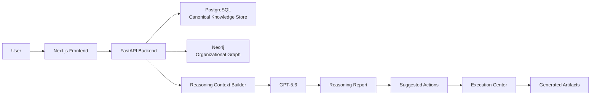
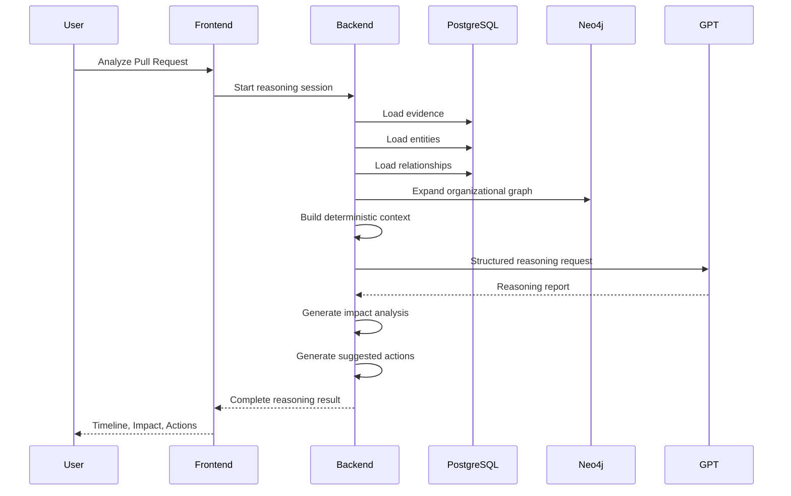
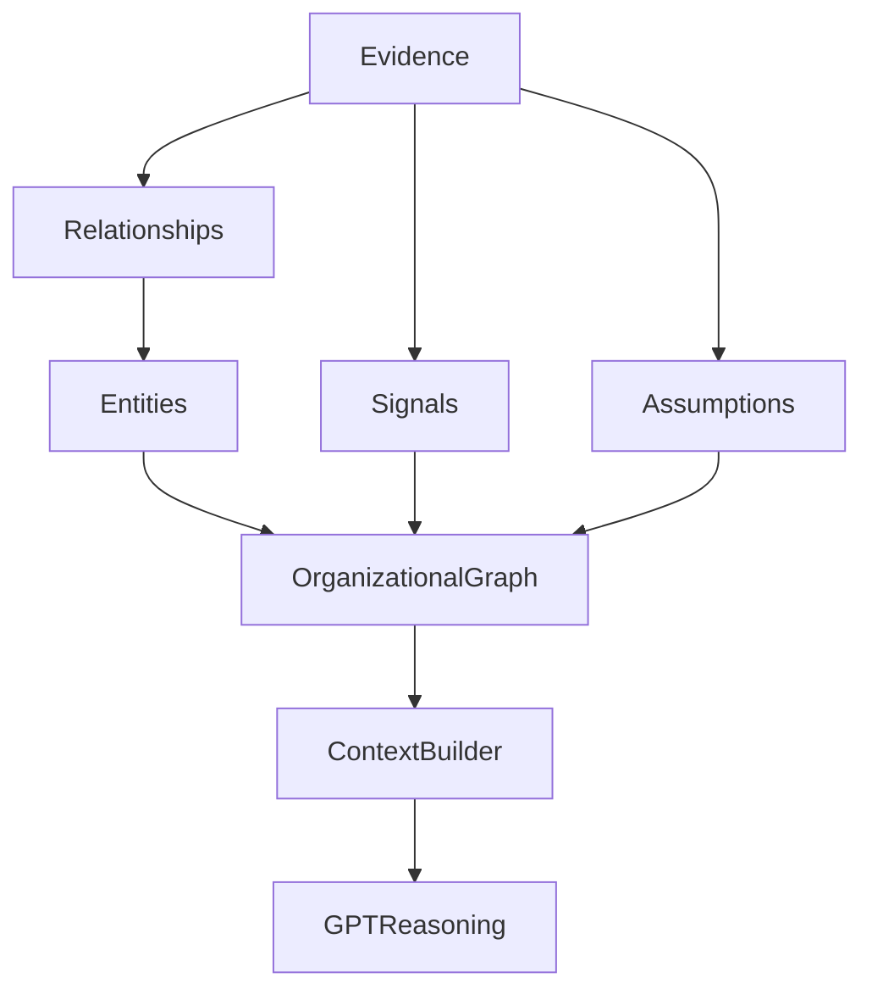
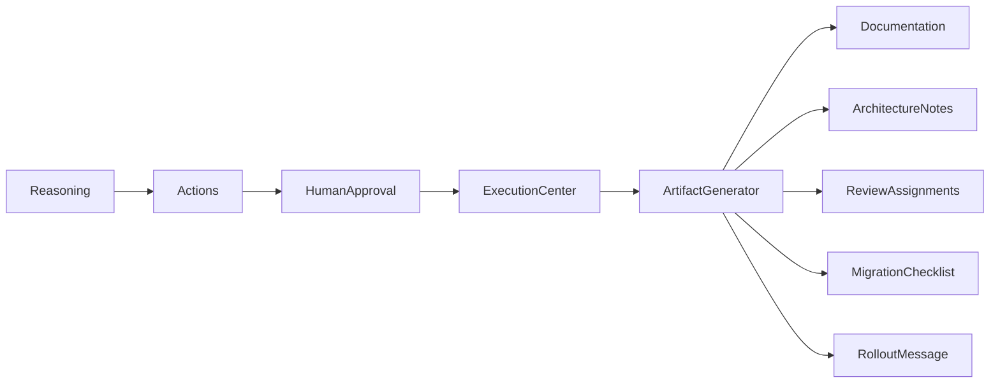
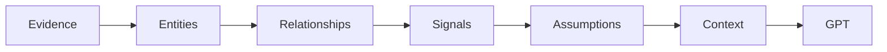

# ORE

## Table of Contents

- [Vision](#vision)
- [At a Glance](#at-a-glance)
- [How ORE Was Designed and Built with GPT-5.6 & Codex](#how-ore-was-designed-and-built-with-gpt-56--codex)
- [The Organizational Reasoning Problem](#the-organizational-reasoning-problem)
- [Core Concepts](#core-concepts)
- [Product Tour](#product-tour)
- [System Architecture](#system-architecture)
- [The Organizational Reasoning Engine](#the-organizational-reasoning-engine)
- [AI Architecture](#ai-architecture)
- [Repository & Codebase Guide](#repository--codebase-guide)
- [Running ORE Locally](#running-ore-locally)
- [Engineering Deep Dive](#engineering-deep-dive)
- [Design Decisions & Engineering Trade-offs](#design-decisions--engineering-trade-offs)
- [Roadmap & Future Work](#roadmap--future-work)
- [Closing Thoughts](#closing-thoughts)
### Organizational Reasoning Engine

> **An AI system that builds an evidence-backed understanding of how an organization actually works—before it reasons, recommends, or acts.**

ORE is an experimental organizational intelligence system that continuously transforms fragmented engineering knowledge into a structured organizational model capable of producing transparent, explainable, and evidence-backed reasoning.

Unlike traditional AI assistants that retrieve isolated documents or answer questions from individual sources, ORE first constructs an explicit representation of the organization itself—its people, services, repositories, ownership structures, operational knowledge, architectural relationships, and historical evidence. Every recommendation is grounded in this evolving organizational understanding.

From a single pull request, architecture proposal, or engineering question, ORE can reason across organizational context, identify hidden dependencies, assess potential impact, propose coordinated actions, and generate implementation artifacts while maintaining complete transparency into how each conclusion was reached.

---

## Vision

Modern software organizations have become too complex for information alone to be useful.

Engineering knowledge exists everywhere:

* GitHub pull requests
* Architecture documents
* RFCs
* Incident reports
* Deployment histories
* Internal documentation
* Operational runbooks
* Slack discussions
* Individual engineers' experience

Each of these sources captures only a small part of how an organization functions. While they collectively describe the organization, they are rarely connected into a coherent model that software systems can reason over.

As organizations scale, knowledge becomes increasingly fragmented. Teams change ownership, services evolve, documentation drifts from implementation, and critical context becomes distributed across dozens of disconnected systems.

Human engineers compensate for this fragmentation through intuition and experience. They learn invisible relationships over months or years:

* which services are tightly coupled,
* which teams usually review certain changes,
* where undocumented dependencies exist,
* which incidents changed architectural assumptions,
* and which people possess critical organizational knowledge.

Today's AI systems typically do not.

Our vision is to build AI systems that reason about organizations the way experienced engineers do—not by searching isolated documents, but by understanding the organization as an interconnected system of evidence, relationships, and evolving knowledge.

ORE is an exploration of that vision.

---

# Why ORE Exists

Most engineering AI tools answer questions.

ORE attempts to answer a different problem.

## Organizations are not documents.

Organizations are living systems.

Every engineering decision affects multiple layers simultaneously:

* architecture
* ownership
* operations
* deployment
* documentation
* collaboration
* organizational risk

A seemingly small pull request may require:

* another team's approval,
* updates to operational runbooks,
* modifications to architectural documentation,
* deployment coordination,
* stakeholder communication,
* or changes to incident response procedures.

These relationships rarely exist inside a single document.

Instead, they emerge from many independent pieces of evidence accumulated over time.

Traditional retrieval systems excel at finding relevant information.

They are considerably less effective at understanding why that information matters together.

Without an explicit model of organizational structure, an AI assistant often treats every retrieved document as independent context, leaving it to the language model to infer relationships that were never formally represented.

This limits both transparency and reliability.

ORE approaches the problem differently.

Rather than asking:

> "Which documents should I retrieve?"

ORE first asks:

> "What does the organization currently know about itself?"

Only after reconstructing that organizational understanding does reasoning begin.

---

# Product Philosophy

ORE is built around a simple principle:

> **Reasoning should emerge from organizational understanding, not from raw retrieval.**

Everything in the system follows from this idea.

Before any language model is invoked, ORE deterministically assembles structured organizational context from canonical evidence, entities, relationships, organizational signals, and assumptions. This structured representation becomes the foundation upon which reasoning operates, rather than allowing the language model to infer organizational structure directly from unstructured text. 

This philosophy leads to several core design principles.

## Evidence Before Conclusions

Every meaningful conclusion should be traceable back to supporting evidence.

Recommendations are not intended to appear as unexplained AI outputs. Instead, they are linked to the organizational evidence that informed them, allowing engineers to inspect the reasoning process and understand why a recommendation was produced.

Transparency is treated as a design requirement rather than an optional feature.

---

## Structure Before Intelligence

Large language models are exceptionally capable reasoning systems, but they perform best when operating over well-structured context.

ORE therefore separates two responsibilities:

* deterministic organization building
* probabilistic reasoning

Deterministic components establish the organizational state by constructing entities, relationships, evidence, signals, assumptions, and graph neighborhoods.

Only after this organizational model has been assembled is a language model asked to reason over it.

This separation improves consistency, makes the reasoning pipeline inspectable, and allows deterministic components to evolve independently of the reasoning model.

---

## Organizations Are Graphs, Not Lists

Organizations are fundamentally networks.

Repositories depend on services.

Services belong to teams.

Teams own documentation.

People review pull requests.

Incidents modify operational assumptions.

Architectural decisions influence future deployments.

Representing these relationships explicitly enables reasoning that extends beyond keyword matching or document retrieval.

Rather than viewing information as isolated records, ORE models organizations as connected systems whose structure itself becomes a source of knowledge.

---

## Human Approval Remains the Boundary

ORE is intentionally designed so that organizational reasoning and organizational execution are separate concerns.

The system may recommend actions, generate implementation artifacts, or prepare engineering deliverables, but execution always passes through an explicit human approval boundary.

Recommendations support engineering teams—they do not replace engineering judgment.

This principle is reflected throughout the system architecture, where generated artifacts remain previews until explicitly approved. 

---

## Engineering Systems Should Explain Themselves

One of ORE's central goals is explainability.

A recommendation is only as useful as an engineer's confidence in it.

For that reason, ORE exposes the intermediate reasoning process rather than hiding it behind a single generated response.

The system makes visible:

* the evidence considered,
* the organizational relationships explored,
* the signals identified,
* the assumptions activated,
* the hypotheses evaluated,
* the predicted impacts,
* and the resulting actions.

By exposing this reasoning pipeline, ORE enables engineers to inspect, validate, and challenge AI-generated conclusions instead of treating them as opaque outputs.

---

## At a Glance
| | |
|---|---|
| **Problem** | Engineering knowledge is fragmented across repositories, documentation, incidents, pull requests, and people, making organizational reasoning difficult for both humans and AI systems. |
| **Solution** | ORE constructs a canonical organizational knowledge model before reasoning, enabling evidence-backed analysis instead of isolated document retrieval. |
| **Core Technologies** | Next.js, FastAPI, PostgreSQL, Neo4j, GPT-5.6, Docker |
| **Reasoning Pipeline** | Evidence → Organizational Graph → Signals → Assumptions → Hypotheses → Impact Analysis → Suggested Actions |
| **Execution Model** | Human-approved execution boundary with deterministic artifact generation and complete reasoning traceability. |
| **Primary Goal** | Demonstrate how AI systems can reason about organizations rather than simply retrieve organizational information. |

---
## How ORE Was Designed and Built with GPT-5.6 & Codex

One of the goals of OpenAI Build Week is not simply to build an application *using* GPT-5.6 and Codex, but to explore what modern AI-assisted software engineering can look like in practice.

ORE was intentionally built around that philosophy.

Rather than treating GPT-5.6 as a feature inside the application and Codex as a code generator, this project used both as integral parts of the complete engineering lifecycle—from product ideation and architectural design to implementation, testing, refinement, and documentation.

The result is not simply an application powered by GPT-5.6.

It is a project whose product vision, engineering process, implementation, and final software were developed through a deliberate collaboration between human engineering judgment, GPT-5.6, and Codex.

---

### At a Glance

| Component | Role Throughout Development |
|-----------|-----------------------------|
| **GPT-5.6** | Product ideation, reasoning philosophy, system architecture, design freeze, implementation planning, technical writing, design refinement, and engineering decision support. |
| **Codex** | Primary implementation engine responsible for generating the project's codebase through milestone-driven development, debugging, refactoring, code reviews, and iterative engineering execution. |
| **Developer** | Product vision, problem selection, architectural direction, milestone definition, prompt engineering, implementation validation, testing, quality assurance, and final engineering decisions. |

---

### Designing ORE with GPT-5.6

Before writing any code, the project was intentionally designed using GPT-5.6 as a collaborative engineering and product design partner.

Instead of immediately implementing features, development began with a more fundamental question:

> **How should an AI system reason about an organization rather than simply retrieve organizational information?**

Over many iterative design sessions, GPT-5.6 helped transform that question into a coherent product architecture.

Together, this process produced:

- the core philosophy behind Organizational Reasoning,
- the evidence-first reasoning model,
- the layered organizational knowledge architecture,
- the overall system architecture,
- the organizational graph model,
- the reasoning pipeline,
- the execution workflow,
- the product experience,
- and the engineering principles that guided every subsequent implementation decision.

Rather than allowing the architecture to emerge during implementation, the project's major technical decisions were intentionally documented, reviewed, refined, and frozen before development began.

This resulted in a comprehensive design specification describing the product vision, evidence model, reasoning engine, system architecture, implementation strategy, and engineering philosophy before the first milestone was implemented.

---

### From Design to Implementation

Once the architecture had been finalized, GPT-5.6 was used to transform the design specification into an actionable engineering roadmap.

Instead of implementing the application as one large task, the project was decomposed into a sequence of well-defined implementation milestones.

Each milestone represented a self-contained engineering objective with clearly defined functionality, implementation requirements, acceptance criteria, and verification steps.

This ensured that implementation followed the architecture, rather than allowing the architecture to evolve unpredictably during development.

The overall engineering workflow followed the process below:

```text
Problem Definition
        │
        ▼
Product Vision
        │
        ▼
Architecture Design
        │
        ▼
Design Freeze
        │
        ▼
Implementation Plan
        │
        ▼
Milestone Specification
        │
        ▼
Codex Implementation
        │
        ▼
Testing & Validation
        │
        ▼
Review & Refinement
        │
        ▼
Next Milestone
```

This milestone-driven workflow allowed architectural consistency to be maintained throughout the project while enabling rapid and iterative implementation.

### Building ORE with Codex

After the architecture and implementation roadmap had been established, **Codex became the primary implementation engine for the project.**

Rather than generating the application in a single prompt, every feature was developed through an iterative milestone-based workflow.

Each milestone was accompanied by detailed engineering specifications describing:

- the objective,
- expected architecture,
- implementation constraints,
- functional requirements,
- acceptance criteria,
- and verification steps.

Codex then translated those specifications into working software.

For every milestone, the development workflow remained consistent:

1. Define the engineering objective.
2. Prepare a detailed implementation specification.
3. Ask Codex to implement the milestone.
4. Review the generated implementation.
5. Test and validate the functionality locally.
6. Refine or iterate where necessary.
7. Commit the completed milestone before beginning the next.

This disciplined process preserved architectural consistency across the repository while allowing implementation to progress rapidly.

From the initial project scaffold to the final application, **every implementation contained within this repository was produced through Codex-assisted development.**

Throughout the project, Codex was used for:

- frontend implementation,
- backend implementation,
- REST API development,
- database models,
- reasoning pipeline implementation,
- Docker configuration,
- debugging,
- refactoring,
- code reviews,
- iterative improvements,
- documentation support,
- and general engineering execution across every milestone.

### Human + AI Engineering Workflow

Although GPT-5.6 and Codex performed much of the architectural exploration and implementation work, they were never treated as autonomous replacements for engineering judgment.

Instead, the project followed a collaborative workflow in which each participant had clearly defined responsibilities.

The developer remained responsible for:

- identifying the problem worth solving,
- defining the product vision,
- evaluating architectural alternatives,
- establishing system boundaries,
- defining implementation milestones,
- reviewing generated implementations,
- validating functionality,
- refining prompts,
- and making the final engineering decisions throughout the project.

GPT-5.6 contributed architectural reasoning, implementation planning, product refinement, and technical design.

Codex translated those engineering specifications into working software through iterative implementation.

This separation allowed each participant to contribute where they were strongest while keeping the overall architecture intentional, coherent, and internally consistent.

### Why This Workflow Matters

ORE explores organizational reasoning as a product.

Building ORE also became an exploration of modern AI-assisted software engineering.

Rather than asking GPT-5.6 to generate isolated ideas or asking Codex to produce isolated code snippets, the project treated AI as a collaborative engineering partner throughout the complete software development lifecycle.

The resulting workflow combined:

- human product vision,
- GPT-5.6 for product thinking, architectural reasoning, and implementation planning,
- Codex for engineering execution and iterative implementation,
- and continuous testing, validation, and refinement after every milestone.

Interestingly, the same principles that define ORE itself—structured reasoning, deliberate planning, transparency, modular design, and iterative refinement—also became the principles that guided how ORE was designed and built.
---

# The Organizational Reasoning Problem

## Software Organizations Have Outgrown Traditional AI

Modern software organizations generate an enormous amount of knowledge every day.

Every pull request, architecture review, incident report, deployment, design document, RFC, and technical discussion contributes another piece to the organization's understanding of itself.

Individually, these artifacts are valuable.

Collectively, they describe how the organization actually functions.

Unfortunately, they rarely exist as a unified system.

Instead, organizational knowledge becomes fragmented across dozens of independent tools:

- GitHub stores source code and pull requests.
- Documentation platforms capture architectural decisions.
- Incident management systems record operational failures.
- Slack preserves engineering discussions.
- Runbooks describe operational procedures.
- Deployment systems record production changes.
- Individual engineers accumulate undocumented institutional knowledge.

Each system contains only a partial view of reality.

The relationships between them—the context that experienced engineers naturally build over years of working within an organization—remain largely implicit.

This fragmentation creates one of the biggest challenges in modern engineering: the organization knows more than any individual document can express.

---

## Why Retrieval Isn't Enough

Recent advances in Retrieval-Augmented Generation (RAG) have significantly improved the ability of language models to answer questions using external information.

Retrieval systems are extremely effective at locating relevant documents.

However, finding relevant information is fundamentally different from understanding an organization.

Suppose an engineer asks:

> **"What could be affected if we merge this pull request?"**

A retrieval system might return:

- the pull request,
- an architecture document,
- a deployment guide,
- a previous incident,
- and a related RFC.

All of those documents may be relevant.

But the retrieval engine does not explicitly understand:

- which team owns the affected service,
- which repositories depend on it,
- whether previous incidents involved the same component,
- whether deployment ownership has changed,
- which reviewers typically approve similar changes,
- or whether undocumented organizational dependencies exist.

The language model must infer these relationships on its own from unstructured text.

This approach works surprisingly well for many tasks, but it also introduces several limitations:

- Important relationships remain implicit.
- Organizational context is reconstructed from scratch for every query.
- The reasoning process becomes difficult to inspect.
- Conclusions are harder to verify against supporting evidence.
- Similar questions may produce inconsistent reasoning depending on retrieved context.

Retrieval provides information.

Organizational reasoning requires understanding.

Those are fundamentally different capabilities.

---

## Why Organizations Need Their Own Reasoning Model

Experienced engineers rarely make decisions by reading one document.

Instead, they combine multiple forms of knowledge simultaneously.

When reviewing a pull request, they instinctively consider questions such as:

- Who owns this service?
- Which teams depend on it?
- Has this component caused incidents before?
- Which operational runbooks may require updates?
- Which deployment pipelines could be affected?
- Which architectural assumptions might change?
- Who should review this change?
- What downstream documentation should be updated?

Notice that most of these questions are not answered by a single source.

They emerge from relationships between many independent pieces of evidence.

This organizational context is precisely what enables experienced engineers to anticipate consequences that are not explicitly documented anywhere.

ORE is built around the idea that AI systems should construct this same organizational context explicitly instead of expecting a language model to infer it implicitly every time.

---

## From Information to Organizational Understanding

ORE treats organizational knowledge as a connected system rather than a collection of isolated documents.

Instead of reasoning directly over retrieved text, the system first constructs a structured organizational model composed of:

- canonical entities,
- explicit relationships,
- supporting evidence,
- organizational signals,
- active assumptions,
- and graph-based context.

Only after this deterministic organizational context has been assembled does the reasoning engine begin generating hypotheses, assessing impact, and proposing actions.

This shift changes the role of the language model.

Instead of asking the model to discover organizational structure, ORE asks it to reason over organizational structure that has already been explicitly constructed.

The distinction is subtle but important.

The language model becomes a reasoning engine rather than a knowledge reconstruction engine.

---

# Core Concepts

ORE is built around several foundational concepts that together define its reasoning model.

## Evidence

Evidence represents the canonical facts known about an organization.

Examples include:

- Pull requests
- Architecture documents
- RFCs
- Incident reports
- Deployment records
- Runbooks
- Repository metadata
- Organizational documentation

Evidence forms the factual foundation of every reasoning session.

Rather than treating documents as isolated context, ORE explicitly links evidence to organizational entities, relationships, signals, and assumptions, allowing every conclusion to be traced back to its supporting sources.

---

## Organizational Entities

Entities represent the important components that exist within an organization.

Examples include:

- Teams
- Engineers
- Services
- Repositories
- Features
- Pull Requests
- Incidents
- Deployments
- Documentation
- External dependencies

These entities form the nodes of the organizational graph and provide the structural backbone for reasoning.

---

## Relationships

Organizations are defined not only by what exists but also by how those components interact.

Relationships capture these connections explicitly.

Examples include:

- owns
- maintains
- depends_on
- reviews
- contributes_to
- deploys
- documents
- affects

By representing relationships directly, ORE can reason across organizational structure instead of relying solely on textual similarity between documents.

---

## Organizational Signals

Signals are higher-level observations derived from organizational evidence and relationships.

Examples include:

- ownership confidence,
- review patterns,
- service coupling,
- deployment habits,
- cross-team collaboration,
- documentation coverage,
- operational risk.

Signals help transform raw organizational data into meaningful characteristics that influence downstream reasoning.

---

## Assumptions

Not every aspect of an organization can be directly observed.

Some knowledge exists as informed assumptions supported by available evidence.

Examples include assumptions about:

- ownership,
- operational responsibility,
- deployment behavior,
- architectural dependencies,
- reviewer expertise,
- communication patterns.

ORE explicitly models these assumptions rather than allowing them to remain hidden inside model reasoning.

This makes assumptions inspectable, challengeable, and replaceable as new evidence becomes available.

---

## Organizational Reasoning

Reasoning begins only after the organizational model has been assembled.

The reasoning engine evaluates organizational context by progressively moving through multiple stages, including evidence collection, graph expansion, signal activation, hypothesis generation, impact prediction, and action planning. The resulting recommendations remain grounded in explicit organizational context rather than isolated documents.

---

## Explainability by Design

One of ORE's defining principles is that reasoning should never be opaque.

Every recommendation should answer three questions:

1. **What evidence supports this conclusion?**
2. **Why did the system reach this conclusion?**
3. **Which organizational relationships influenced the outcome?**

Rather than presenting AI-generated recommendations as unquestionable answers, ORE exposes the intermediate reasoning process so engineers can inspect, validate, and build confidence in every recommendation.

Explainability is therefore not an additional feature layered onto the system—it is a core property of the organizational reasoning model itself.

# Product Tour

Before diving into the implementation details, it is helpful to understand how a typical reasoning session flows through ORE.

At a high level, the system follows a deterministic organizational reasoning pipeline.

```text
Evidence
    │
    ▼
Organizational Graph
    │
    ▼
Context Assembly
    │
    ▼
Reasoning
    │
    ▼
Impact Analysis
    │
    ▼
Suggested Actions
    │
    ▼
Execution
```

Each interface within ORE corresponds to one stage of this pipeline.

Rather than acting as independent pages, the application's views represent consecutive stages in a single organizational reasoning workflow.

---

## Dashboard


The Dashboard provides a high-level overview of the organization's current operational state.

It serves as the primary entry point into the reasoning workflow and summarizes the information most relevant to engineering decision-making.

The dashboard aggregates data from PostgreSQL, Neo4j, completed reasoning sessions, evidence records, and execution history into a single operational view.

Key information includes:

- Organizational health metrics
- Knowledge coverage indicators
- Recent pull requests
- Recent reasoning sessions
- Recent organizational activity
- Graph preview
- Active engineering insights

Rather than presenting static project statistics, the Dashboard is designed to answer a single question:

> **"What should an engineer understand about the organization before making their next decision?"**

---

## Evidence Explorer


Every reasoning session begins with evidence.

The Evidence Explorer provides access to the canonical evidence stored within the organization.

Evidence currently includes sources such as:

- Pull Requests
- Architecture Documents
- RFCs
- Runbooks
- Incident Reports
- Repository Metadata
- Deployment Records
- Organizational Documentation

Each evidence record contains metadata describing:

- origin,
- author,
- timestamp,
- associated entities,
- supported relationships,
- linked organizational signals,
- supporting assumptions.

The interface supports filtering by evidence type, source, and free-text search, allowing engineers to inspect exactly which information contributes to organizational reasoning.

Unlike traditional document search, evidence in ORE is not treated as isolated text.

Every evidence record participates in the broader organizational knowledge model.

---

## Organizational Graph


The Organizational Graph visualizes how knowledge is connected across the organization.

Nodes represent organizational entities, including:

- teams,
- repositories,
- services,
- engineers,
- pull requests,
- documentation,
- incidents,
- deployments,
- external dependencies.

Edges represent explicit organizational relationships such as ownership, dependencies, review patterns, documentation links, deployment relationships, and service interactions.

Unlike many graph visualizations that exist primarily for exploration, this graph directly influences reasoning.

During context construction, ORE expands the graph around the focus entity to discover nearby organizational context before invoking the reasoning engine.

This allows reasoning to extend beyond directly attached documents and incorporate structural organizational knowledge.

---

## Organizational Reasoning


The Reasoning view exposes how ORE reaches its conclusions.

Rather than presenting a single generated response, the interface visualizes the intermediate reasoning process.

Each reasoning session progresses through multiple stages, including:

1. Collecting Evidence
2. Expanding Organizational Context
3. Activating Organizational Signals
4. Retrieving Active Assumptions
5. Generating Hypotheses
6. Validating Supporting Evidence
7. Resolving Conflicts
8. Predicting Organizational Impact
9. Planning Suggested Actions

These stages are reconstructed from the stored reasoning report and deterministic organizational context, allowing engineers to inspect the reasoning process instead of treating the model as a black box.

Throughout the interface, supporting evidence remains accessible, enabling every conclusion to be traced back to its underlying organizational knowledge.

---

## Impact Report


Once reasoning has completed, ORE produces an organizational impact assessment.

Rather than describing only code-level changes, the report evaluates how the proposed change affects the wider engineering organization.

The Impact Report summarizes:

- overall impact level,
- confidence,
- affected services,
- affected teams,
- primary risks,
- supporting evidence,
- organizational findings.

The report is derived by combining the reasoning output with graph relationships and evidence, producing an explanation that remains grounded in the organization's current state rather than a generic language-model summary.

Engineers can navigate directly from each impact finding back to the evidence supporting that conclusion.

---

## Suggested Actions


Understanding organizational impact is only one part of engineering decision-making.

ORE also proposes concrete organizational actions.

These recommendations may include:

- updating operational runbooks,
- assigning reviewers,
- preparing deployment checklists,
- drafting Slack communications,
- updating architecture documentation,
- generating pull request summaries,
- producing migration guidance.

Every action contains:

- supporting evidence,
- confidence,
- execution status,
- artifact preview,
- approval state.

Actions remain editable prior to approval, reinforcing the principle that AI assists engineering workflows rather than replacing engineering judgment.

---

## Execution Center


The final stage of the workflow is execution.

The Execution Center manages the transition from organizational reasoning to engineering artifacts.

Once an action has been explicitly approved, ORE generates a corresponding artifact through its execution layer.

Generated artifacts may include:

- documentation updates,
- architecture notes,
- rollout messages,
- review assignments,
- migration checklists,
- pull request summaries.

Importantly, execution never performs production modifications.

The system generates artifact previews, records execution metadata, persists logs, and clearly indicates that no external repositories, documentation systems, communication platforms, or production infrastructure have been modified.

This explicit human approval boundary is one of ORE's core design principles, ensuring that organizational reasoning remains transparent, reviewable, and safely integrated into existing engineering workflows.

---

The Product Tour mirrors the lifecycle of a complete reasoning session.

From evidence collection through graph exploration, structured reasoning, organizational impact analysis, recommended actions, and finally human-approved execution, each interface contributes to a single objective:

> **Helping engineers understand how a change affects the organization—not just the codebase.**

# System Architecture

ORE is designed around a simple architectural principle:

> **Keep organizational knowledge deterministic. Use language models only for reasoning over that knowledge—not for constructing it.**

The system is divided into four primary layers:

1. **Presentation Layer** — Interactive user interface built with Next.js.
2. **Application Layer** — FastAPI services responsible for orchestration and business logic.
3. **Knowledge Layer** — PostgreSQL and Neo4j storing canonical organizational knowledge.
4. **Reasoning Layer** — GPT-5.6 performing structured reasoning over deterministic organizational context.

This separation allows every stage of the reasoning pipeline to remain inspectable, testable, and independently evolvable.

---

## High-Level Architecture



The frontend never communicates directly with the databases or the language model.

All requests pass through the backend, which is responsible for assembling organizational context, orchestrating reasoning sessions, enforcing business rules, and maintaining the safety boundary before execution.

---

## Layered Architecture

```text
┌──────────────────────────────────────────────┐
│              Presentation Layer              │
│            Next.js + React + TypeScript      │
└──────────────────────────────────────────────┘
                     │
                     ▼
┌──────────────────────────────────────────────┐
│             Application Layer                │
│        FastAPI Services & API Routers        │
└──────────────────────────────────────────────┘
                     │
         ┌───────────┴───────────┐
         ▼                       ▼
┌─────────────────┐     ┌──────────────────────┐
│   PostgreSQL    │     │       Neo4j          │
│ Canonical Model │     │ Organizational Graph │
└─────────────────┘     └──────────────────────┘
         │                       │
         └───────────┬───────────┘
                     ▼
┌──────────────────────────────────────────────┐
│      Deterministic Context Assembly          │
└──────────────────────────────────────────────┘
                     │
                     ▼
┌──────────────────────────────────────────────┐
│         GPT-5.6 Reasoning Engine             │
└──────────────────────────────────────────────┘
                     │
                     ▼
┌──────────────────────────────────────────────┐
│      Impact → Actions → Execution            │
└──────────────────────────────────────────────┘
```

Each layer has a clearly defined responsibility.

No layer bypasses another.

This minimizes coupling while making the reasoning pipeline significantly easier to inspect and maintain.

---

## Request Lifecycle

The following diagram illustrates a complete reasoning session initiated from the Dashboard.



One important design decision is that GPT is **never responsible for discovering organizational context**.

Instead, the backend assembles a deterministic context object first and only then invokes the reasoning model. This reduces ambiguity, improves reproducibility, and keeps the reasoning process grounded in canonical organizational knowledge.

---

## Organizational Knowledge Architecture

ORE models organizations as connected systems rather than collections of documents.



The organizational graph is not generated by GPT.

Instead, it is deterministically constructed from canonical organizational records stored in PostgreSQL and synchronized into Neo4j for graph traversal and relationship exploration.

This distinction is fundamental to ORE's architecture.

Rather than asking the language model to infer organizational structure from text, the system explicitly models that structure before reasoning begins.

---

## Data Flow

A single reasoning request flows through the following pipeline.

```text
Pull Request
      │
      ▼
Evidence Retrieval
      │
      ▼
Entity Resolution
      │
      ▼
Relationship Expansion
      │
      ▼
Signal Collection
      │
      ▼
Assumption Retrieval
      │
      ▼
Context Assembly
      │
      ▼
GPT-5.6 Reasoning
      │
      ▼
Reasoning Report
      │
      ▼
Impact Analysis
      │
      ▼
Suggested Actions
      │
      ▼
Execution Approval
```

Each stage progressively enriches the organizational context before any reasoning occurs.

This staged approach allows intermediate outputs to remain visible, inspectable, and independently verifiable.

---

## Frontend Architecture

The frontend is implemented as a Next.js application using React and TypeScript.

Instead of treating each page as an isolated application, ORE is implemented as a unified workspace where every interface represents a different stage of the same reasoning workflow.

The application currently provides seven primary views:

- Dashboard
- Evidence Explorer
- Organizational Graph
- Organizational Reasoning
- Impact Report
- Suggested Actions
- Execution Center

Application state is managed locally using React state and shared across these views, while backend communication occurs through a lightweight JSON API layer.

This architecture keeps the user experience continuous while avoiding unnecessary complexity for the MVP.

---

## Backend Architecture

The backend is implemented using FastAPI and follows a service-oriented architecture.

Each incoming request progresses through three layers:

```text
API Router
      │
      ▼
Business Service
      │
      ▼
Database / Reasoning Engine
```

API routers remain intentionally thin.

Business logic—including graph synchronization, reasoning context construction, action generation, dashboard aggregation, and execution safety—is encapsulated within dedicated service classes.

This separation keeps HTTP concerns independent from organizational reasoning logic and allows individual services to evolve without affecting the external API.

---

## Knowledge Layer

ORE separates storage responsibilities across two complementary databases.

### PostgreSQL

PostgreSQL serves as the canonical source of truth for:

- organizations,
- repositories,
- pull requests,
- evidence,
- entities,
- relationships,
- organizational signals,
- assumptions,
- reasoning sessions,
- actions,
- execution history.

Every write operation ultimately persists to PostgreSQL.

---

### Neo4j

Neo4j stores an organizational graph synchronized from PostgreSQL.

It is **not** the canonical source of truth.

Instead, Neo4j enables efficient traversal of organizational relationships during context expansion and graph visualization.

This projection-based architecture avoids duplicated business logic while allowing graph operations to remain performant and expressive.

---

## Reasoning Layer

The reasoning layer operates only after deterministic context construction has completed.

Its responsibilities include:

- evaluating organizational context,
- generating hypotheses,
- predicting organizational impact,
- identifying supporting evidence,
- proposing organizational actions.

Importantly, GPT-5.6 never queries databases directly and never retrieves organizational information independently.

It receives a fully assembled reasoning context produced by the backend and returns a structured reasoning report conforming to a predefined schema.

This architecture intentionally separates **knowledge construction** from **knowledge reasoning**, allowing each concern to evolve independently.

---

## Execution Architecture

Reasoning alone does not change organizational state.

The execution pipeline introduces an explicit human approval boundary.



Approved actions produce engineering artifacts through the execution layer.

However, the system deliberately stops short of modifying external repositories, documentation platforms, messaging systems, or production infrastructure.

Instead, generated artifacts remain reviewable previews that engineers may adopt or discard as appropriate.

---

## Architectural Principles

Several principles guided every architectural decision in ORE.

### Deterministic Before Probabilistic

Organizational knowledge should be assembled deterministically before probabilistic reasoning begins.

---

### Canonical Data Model

PostgreSQL remains the single source of truth for organizational knowledge.

---

### Graphs Represent Relationships

Neo4j exists to model organizational connectivity rather than duplicate business data.

---

### Transparent Reasoning

Every recommendation should remain explainable through evidence, entities, relationships, and intermediate reasoning stages.

---

### Human Oversight

Execution always requires explicit human approval before organizational artifacts are generated.

---

Taken together, these principles enable ORE to function as more than a document retrieval system.

Rather than searching organizational knowledge in isolation, the system constructs a structured understanding of how an organization operates and then reasons over that understanding in a transparent, evidence-backed manner.

# The Organizational Reasoning Engine

At the heart of ORE is a simple observation:

> **Organizations cannot be understood by reading individual documents in isolation.**

Engineering organizations are systems of interconnected people, services, repositories, deployments, incidents, documentation, and decisions.

Every change propagates through this network of relationships.

Traditional AI systems typically reason directly over retrieved documents.

ORE takes a different approach.

Instead of asking a language model to reconstruct an organization's structure during every prompt, ORE first builds an explicit organizational model and only then performs reasoning over that model.

This separation between **knowledge construction** and **knowledge reasoning** is the defining architectural principle behind ORE.

---

# From Documents to Organizational Understanding

Most organizational information begins life as documents.

Examples include:

- Pull Requests
- Architecture Documents
- RFCs
- Incident Reports
- Deployment Logs
- Runbooks
- Repository Metadata
- Engineering Discussions

Individually, these artifacts describe isolated events.

Collectively, they describe how an organization actually operates.

ORE transforms these disconnected pieces of information into a structured representation that can be reasoned about.

```text
Documents
      │
      ▼
Evidence
      │
      ▼
Entities
      │
      ▼
Relationships
      │
      ▼
Signals
      │
      ▼
Assumptions
      │
      ▼
Organizational Context
      │
      ▼
GPT Reasoning
```

Rather than reasoning directly over documents, the system progressively enriches organizational understanding through multiple deterministic stages before invoking the language model.

---

# Layer 1 — Evidence

Evidence is the foundation of every reasoning session.

It represents verifiable organizational facts collected from the engineering ecosystem.

Examples include:

- Pull Requests
- Design Documents
- Architecture Decisions
- Incident Reports
- Deployment Records
- Runbooks
- Repository Metadata
- Internal Documentation

Evidence is intentionally passive.

It does not contain conclusions.

It simply records what is known.

Every higher-level concept within ORE ultimately traces back to one or more evidence records, ensuring that every recommendation remains grounded in observable organizational information rather than model intuition.

---

# Layer 2 — Organizational Entities

Organizations consist of identifiable components.

ORE models these components as organizational entities.

Examples include:

- Teams
- Engineers
- Services
- Repositories
- Pull Requests
- Features
- Deployments
- Documentation
- Incidents
- External Systems

Entities answer the question:

> **"What exists inside this organization?"**

Unlike documents, entities persist over time.

A repository exists independently of any individual pull request.

A service continues to exist after an incident.

A team owns multiple repositories across many deployments.

Modeling entities separately from evidence allows ORE to construct long-lived organizational knowledge rather than transient document collections.

---

# Layer 3 — Relationships

Knowing what exists is only the beginning.

Organizations are defined by interactions between their components.

Relationships explicitly capture these interactions.

Examples include:

- owns
- maintains
- depends_on
- reviews
- contributes_to
- deploys
- documents
- affects

Rather than forcing the language model to infer these relationships from natural language, ORE stores them explicitly as first-class organizational knowledge.

This enables reasoning to extend naturally across organizational boundaries.

For example:

```text
Repository
      │
      ▼
Service
      │
      ▼
Deployment
      │
      ▼
Incident
      │
      ▼
Runbook
```

None of these connections necessarily appear inside the same document.

Yet together they describe how the organization behaves.

---

# Layer 4 — Organizational Signals

Evidence and relationships describe the organization.

Signals characterize it.

Signals are higher-level observations derived from multiple pieces of organizational information.

Examples include:

- Ownership confidence
- Cross-team collaboration
- Review patterns
- Documentation quality
- Service coupling
- Deployment frequency
- Operational risk
- Change velocity

Signals compress complex organizational behavior into reusable reasoning inputs.

Instead of asking GPT to independently recognize recurring engineering patterns, ORE computes these patterns ahead of time and provides them explicitly during reasoning.

---

# Layer 5 — Assumptions

Real organizations are rarely completely observable.

Some knowledge exists only as reasonable inferences supported by available evidence.

ORE models these inferences explicitly.

Examples include assumptions regarding:

- probable ownership,
- undocumented dependencies,
- operational responsibility,
- reviewer expertise,
- deployment practices,
- architectural intent.

Unlike hidden model assumptions, organizational assumptions remain visible throughout the reasoning process.

As new evidence becomes available, assumptions may be strengthened, weakened, or discarded.

This makes organizational uncertainty transparent instead of implicit.

---

# Building Organizational Context

The five knowledge layers combine to produce a single reasoning context.



This context represents far more than retrieved documents.

It captures:

- organizational structure,
- ownership,
- dependency chains,
- supporting evidence,
- historical context,
- inferred organizational behavior,
- operational characteristics.

Only after this context has been assembled does GPT begin reasoning.

---

# Deterministic Context Construction

One of the most important architectural decisions in ORE is that context construction is deterministic.

The backend—not the language model—is responsible for:

- loading evidence,
- resolving entities,
- traversing organizational relationships,
- expanding graph neighborhoods,
- collecting signals,
- retrieving assumptions,
- assembling the final reasoning context.

This process produces the same organizational model for identical inputs, making the reasoning pipeline substantially easier to inspect, debug, and reproduce.

GPT receives only the completed context.

It never performs independent retrieval or graph exploration.

---

# Structured Reasoning

Once context construction has completed, GPT performs organizational reasoning rather than information gathering.

The reasoning process evaluates:

- supporting evidence,
- organizational dependencies,
- ownership,
- operational risk,
- conflicting observations,
- potential downstream consequences,
- recommended organizational actions.

Instead of generating a single block of text, the reasoning output is structured into multiple stages that can later be visualized within the application.

These stages include:

1. Evidence Review
2. Context Evaluation
3. Signal Analysis
4. Hypothesis Generation
5. Conflict Resolution
6. Impact Assessment
7. Action Planning

Because every stage remains linked to the underlying organizational model, engineers can inspect why conclusions were reached instead of treating them as opaque model outputs.

---

# Why Graphs Matter

Organizations are networks.

Documents are not.

Flat retrieval systems answer questions by searching for similar text.

Graphs answer questions by traversing connected organizational knowledge.

For example, a seemingly simple pull request may connect to:

```text
Pull Request
      │
      ▼
Repository
      │
      ▼
Service
      │
      ▼
Deployment Pipeline
      │
      ▼
Production Incident
      │
      ▼
Operational Runbook
      │
      ▼
Owning Team
```

Reasoning across these relationships enables the system to identify impacts that may never appear together inside any single document.

This is why ORE stores organizational structure separately from natural language.

---

# Explainability as a First-Class Property

Many AI systems generate conclusions that are difficult to inspect.

ORE intentionally exposes the intermediate reasoning process.

Every recommendation can be traced back through:

- supporting evidence,
- organizational entities,
- graph relationships,
- organizational signals,
- active assumptions,
- reasoning stages.

Rather than asking engineers to trust the model, ORE enables them to inspect how each conclusion emerged.

Transparency is therefore not an additional feature layered onto the reasoning engine.

It is a fundamental property of the architecture itself.

---

# The Central Design Principle

Every architectural decision in ORE ultimately supports one idea:

> **Understanding an organization should come before reasoning about it.**

By separating deterministic knowledge construction from probabilistic language-model reasoning, ORE transforms fragmented engineering information into an explicit organizational model before generating recommendations.

The result is a reasoning system that is grounded in evidence, structured by relationships, transparent in its conclusions, and designed to augment engineering judgment rather than replace it.

# AI Architecture

Artificial intelligence is central to ORE—but intentionally constrained.

Rather than allowing a language model to control the entire application, ORE assigns AI a clearly defined responsibility within a larger deterministic architecture.

The system separates **knowledge construction** from **knowledge reasoning**.

The backend is responsible for building an explicit understanding of the organization.

Only after this understanding has been assembled does GPT participate in the workflow.

This design keeps organizational knowledge deterministic while allowing language models to contribute where they are strongest: synthesizing information, evaluating trade-offs, generating hypotheses, and communicating recommendations.

---

### The Role of GPT

GPT is not used as a search engine.

It is not responsible for retrieving documents.

It does not discover organizational relationships.

It does not query databases.

Instead, GPT receives a fully assembled organizational context and performs reasoning over that context.

```text
Organizational Knowledge
          │
          ▼
Deterministic Context Builder
          │
          ▼
     GPT-5.6
          │
          ▼
 Structured Reasoning
          │
          ▼
 Impact Assessment
          │
          ▼
 Suggested Actions
```

By restricting GPT to reasoning rather than knowledge construction, ORE reduces ambiguity while making reasoning significantly easier to inspect and reproduce.

---

### Where GPT Is Used

Within ORE, GPT contributes to several stages of the organizational reasoning pipeline.

### Organizational Reasoning

Given the assembled organizational context, GPT evaluates:

- engineering context,
- organizational dependencies,
- ownership,
- supporting evidence,
- operational risk,
- conflicting observations,
- downstream impact.

The result is a structured reasoning report rather than a conversational response.

---

### Impact Analysis

After reasoning, GPT summarizes the expected organizational consequences of a proposed change.

Rather than describing only code modifications, the model evaluates broader engineering implications such as affected teams, repositories, services, documentation, deployment processes, and operational risk.

---

### Suggested Actions

Using the reasoning report, GPT proposes concrete engineering actions.

Examples include:

- documentation updates,
- rollout plans,
- migration checklists,
- reviewer recommendations,
- communication drafts,
- architectural follow-ups.

Each recommendation remains linked to the evidence and reasoning stages that produced it.

---

### Engineering Artifact Generation

Once an action has been approved, GPT assists in generating engineering artifacts.

Examples include:

- pull request summaries,
- architecture notes,
- rollout messages,
- migration documentation,
- operational checklists.

Importantly, these artifacts remain previews.

ORE deliberately avoids automatically modifying external systems without explicit human approval.

---

### Deterministic Knowledge + Probabilistic Reasoning

One of ORE's most important design principles is the separation between deterministic and probabilistic computation.

| Deterministic Backend | GPT |
|-----------------------|-----|
| Loads evidence | Evaluates evidence |
| Resolves entities | Generates hypotheses |
| Expands graph relationships | Predicts organizational impact |
| Builds context | Produces reasoning report |
| Retrieves assumptions | Suggests engineering actions |

This separation provides several advantages:

- reproducible organizational context,
- consistent reasoning inputs,
- easier debugging,
- improved explainability,
- clearer architectural boundaries.

Rather than replacing traditional software architecture, GPT complements it.

---

### Structured Outputs

ORE does not ask GPT to generate unrestricted free-form text.

Instead, the backend requests structured reasoning that conforms to predefined schemas.

Structured outputs allow the frontend to visualize reasoning as:

- evidence,
- hypotheses,
- signals,
- findings,
- impacts,
- suggested actions,
- execution artifacts.

This architecture transforms language model output into application state rather than plain text, enabling richer user interfaces and significantly better explainability.

---

### Why GPT-5.6

ORE currently uses GPT-5.6 through the OpenAI Responses API.

GPT-5.6 was selected because it provides strong reasoning capabilities while integrating naturally into the structured organizational reasoning pipeline implemented by the backend.

Within ORE, the language model is treated as a reasoning component inside a larger software architecture rather than the architecture itself.

This distinction keeps the application modular, allowing reasoning models to evolve independently of the surrounding organizational knowledge system.

---

### Building ORE with Codex

ORE itself is the product.

Codex was the engineering partner used throughout the development of that product.

The project was intentionally built using an iterative human–AI workflow in which architectural direction, product design, and engineering decisions were guided by the developer while implementation was accelerated through Codex.

Rather than generating an application in a single prompt, development followed an incremental milestone-based process.

Each milestone focused on a well-defined architectural objective before progressing to the next stage.

Examples included:

- project foundation,
- frontend architecture,
- backend services,
- database models,
- graph integration,
- reasoning pipeline,
- execution system,
- user experience refinements,
- deployment.

This iterative workflow allowed every milestone to be reviewed, tested, and refined before introducing additional functionality.

---

### Human-Guided Development

Although Codex accelerated implementation, architectural decisions remained intentional.

The development process emphasized:

- defining product requirements before implementation,
- freezing architectural decisions before coding,
- implementing features incrementally,
- validating functionality after each milestone,
- refactoring where appropriate,
- preserving architectural consistency throughout the project.

This approach mirrors established engineering practices while demonstrating how AI-assisted development can significantly accelerate implementation without replacing thoughtful system design.

---

### Why This Architecture Matters

Many AI-powered applications place the language model at the center of the system.

ORE intentionally does the opposite.

The organizational knowledge model remains the core of the architecture.

GPT contributes reasoning.

Codex accelerated implementation.

Traditional software engineering provides the surrounding infrastructure.

Together, these components form an application where deterministic software, graph-based organizational modeling, and modern language models each perform the tasks they are best suited for.

The result is an AI system designed not simply to generate answers, but to produce transparent, evidence-backed organizational reasoning that engineers can inspect, understand, and ultimately trust.

# Repository & Codebase Guide

This section provides a guided tour of the ORE codebase.

Rather than documenting every file individually, it explains the architectural responsibility of each major directory and how the different parts of the system work together.

If you are exploring the repository for the first time, this section should provide enough context to understand where every major feature is implemented.

---

## Repository Structure

```text
ORE/
├── backend/
│   ├── app/
│   │   ├── api/
│   │   ├── execution/
│   │   ├── graph/
│   │   ├── models/
│   │   ├── reasoning/
│   │   ├── schemas/
│   │   ├── services/
│   │   └── ...
│   ├── migrations/
│   └── ...
│
├── frontend/
│   ├── app/
│   ├── components/
│   ├── hooks/
│   ├── lib/
│   └── ...
│
├── docs/
│
├── docker-compose.yml
│
└── README.md
```

The repository is intentionally divided into two independent applications:

- **Frontend** — responsible for presentation and user interaction.
- **Backend** — responsible for organizational knowledge, reasoning, APIs, and execution.

This separation allows both applications to evolve independently while communicating through a well-defined HTTP API.

---

## Frontend

The frontend is implemented using **Next.js**, **React**, and **TypeScript**.

Its responsibility is deliberately narrow.

It never performs organizational reasoning itself.

Instead, it visualizes organizational knowledge returned by the backend.

The application is organized around the stages of the reasoning workflow rather than independent features.

```text
frontend/

app/
│
├── Dashboard
├── Evidence Explorer
├── Organizational Graph
├── Organizational Reasoning
├── Impact Report
├── Suggested Actions
└── Execution Center
```

Each page represents a different stage of a single reasoning session.

This creates a continuous workflow instead of a collection of unrelated screens.

---

### Components

The `components/` directory contains reusable UI building blocks shared throughout the application.

Examples include:

- cards,
- dialogs,
- navigation,
- graph visualization,
- reasoning timeline,
- evidence views,
- tables,
- badges,
- metrics.

These components intentionally remain presentation-focused.

Business logic is delegated to the backend, allowing UI components to remain reusable and easy to maintain.

---

### Hooks & Utilities

Supporting application logic lives inside the `hooks/` and `lib/` directories.

Typical responsibilities include:

- API communication,
- frontend utilities,
- shared types,
- helper functions,
- application constants.

Keeping these concerns separate from page components improves maintainability while reducing duplicated logic across the application.

---

## Backend

The backend is implemented using **FastAPI** and contains the majority of ORE's application logic.

Where the frontend answers:

> **"How should this information be presented?"**

the backend answers:

> **"How should the organization be understood?"**

The backend is organized into multiple architectural layers.

---

### API Layer

```text
backend/app/api/
```

The API layer exposes REST endpoints used by the frontend.

Its responsibilities include:

- validating requests,
- serializing responses,
- routing requests,
- returning HTTP status codes.

API routers intentionally contain very little business logic.

Instead, they delegate work to dedicated service classes.

This separation keeps the public API stable while allowing internal implementation to evolve independently.

---

### Service Layer

```text
backend/app/services/
```

The service layer is the operational heart of the backend.

Services coordinate application behavior by combining data from multiple sources.

Responsibilities include:

- dashboard aggregation,
- evidence retrieval,
- graph synchronization,
- reasoning orchestration,
- impact generation,
- suggested action generation,
- execution management.

Most application behavior originates within this layer.

---

### Database Models

```text
backend/app/models/
```

The models directory defines the canonical organizational data model.

Entities represented here include:

- organizations,
- repositories,
- pull requests,
- evidence,
- organizational entities,
- relationships,
- signals,
- assumptions,
- reasoning sessions,
- actions,
- execution history.

These SQLAlchemy models define the application's persistent organizational knowledge and ultimately map to PostgreSQL tables.

---

### Schemas

```text
backend/app/schemas/
```

Schemas define the data exchanged between the frontend and backend.

They perform two important roles:

- request validation,
- response serialization.

Using dedicated Pydantic schemas keeps API contracts independent from database models while preventing accidental leakage of internal implementation details.

---

## Organizational Reasoning

```text
backend/app/reasoning/
```

This package contains the implementation of ORE's reasoning workflow.

Its responsibility is not to retrieve organizational knowledge.

Instead, it transforms organizational knowledge into structured reasoning.

The reasoning pipeline includes:

- evidence collection,
- graph expansion,
- signal evaluation,
- assumption retrieval,
- context construction,
- hypothesis generation,
- impact analysis,
- action planning.

The output of this package becomes the reasoning timeline visualized within the frontend.

---

### Graph Layer

```text
backend/app/graph/
```

Organizations are naturally represented as graphs.

This package manages interactions with Neo4j.

Responsibilities include:

- graph synchronization,
- relationship traversal,
- neighborhood expansion,
- graph visualization support.

Rather than serving as the primary source of truth, Neo4j acts as a graph projection built from canonical organizational data stored in PostgreSQL.

---

### Execution Layer

```text
backend/app/execution/
```

The execution layer manages the transition from organizational reasoning to engineering artifacts.

Responsibilities include:

- execution approval,
- artifact generation,
- execution history,
- execution status,
- audit records.

Importantly, execution never performs destructive operations.

Instead, it generates reviewable engineering artifacts while preserving an explicit human approval boundary.

---

## Data Flow Through the Codebase

A complete reasoning request moves through the repository in the following order.

```text
Frontend

↓

API Router

↓

Service Layer

↓

Database Models

↓

Graph Expansion

↓

Reasoning Pipeline

↓

GPT-5.6

↓

Impact Analysis

↓

Suggested Actions

↓

Execution Layer

↓

API Response

↓

Frontend
```

Following this sequence through the repository provides a clear mental model for understanding how ORE processes organizational reasoning requests.

---

## Configuration

Project configuration is intentionally centralized.

Configuration includes:

- environment variables,
- Docker configuration,
- database connections,
- API settings,
- OpenAI configuration,
- development defaults.

This minimizes hard-coded values while making deployments reproducible across development environments.

---

## Development Philosophy

Several engineering principles influenced how the repository is organized.

### Separation of Concerns

Each package owns a clearly defined responsibility.

Presentation, orchestration, persistence, reasoning, graph operations, and execution remain independent.

---

### Thin APIs

API routers validate and route requests.

Business logic belongs inside services.

---

### Canonical Data Model

PostgreSQL remains the authoritative source of organizational knowledge.

Graph data is derived rather than duplicated.

---

### Modular Reasoning

The reasoning pipeline exists independently from the surrounding application infrastructure.

This allows reasoning behavior to evolve without affecting unrelated parts of the codebase.

---

### Human-Centric Architecture

Every major subsystem—from reasoning through execution—is designed around a single principle:

> **Engineers remain in control.**

The application exists to augment organizational decision-making, not automate it blindly.

---

## Navigating the Repository

If you're exploring ORE for the first time, the following order provides the quickest path to understanding the project:

1. Read the README.
2. Explore the frontend pages to understand the user workflow.
3. Inspect the API routers to see available endpoints.
4. Follow requests into the service layer.
5. Explore the reasoning package.
6. Inspect the graph package.
7. Review the execution pipeline.
8. Examine the database models.

By following this progression, you'll move through the repository in the same order that organizational reasoning flows through the application itself.

## Running ORE Locally

ORE is designed to run entirely through Docker, making local setup straightforward.

### Prerequisites

Before starting, ensure the following are installed:

- Docker
- Docker Compose
- An OpenAI API key with access to GPT-5.6

### 1. Clone the Repository

```bash
git clone <repository-url>
cd ORE
```

### 2. Configure Environment Variables

Create a `.env` file in the project root (or copy the provided example if available) and configure your OpenAI API key.

```env
OPENAI_API_KEY=your_api_key_here
```

> **Important:** ORE does **not** include an OpenAI API key. To run the reasoning pipeline locally, you must provide your own API key with access to GPT-5.6.

### 3. Start the Application

```bash
docker compose up --build
```

This will start:

- Frontend
- FastAPI Backend
- PostgreSQL
- Neo4j

### 4. Open the Application

Once the containers are running, open:

- **Frontend:** http://localhost:3000
- **Backend API:** http://localhost:8000
- **Backend Health Check:** http://localhost:8000/health
- **Neo4j Browser:** http://localhost:7474

### Notes

- The repository ships with sample organizational data for demonstration purposes.
- The reasoning pipeline requires a valid OpenAI API key.
- All generated outputs remain local to your environment unless you explicitly connect additional external services.

# Engineering Deep Dive

This section explores the implementation details behind ORE.

Rather than focusing on user-facing features, it explains the engineering decisions that shape the system internally—from API design and data modeling to graph storage, reasoning orchestration, deployment, and operational considerations.

The implementation prioritizes three goals:

- deterministic organizational understanding,
- modular system architecture,
- transparent AI reasoning.

---

## API Design

ORE exposes its functionality through a REST API implemented with FastAPI.

Rather than exposing database models directly, the API is organized around domain capabilities.

Examples include:

- Dashboard aggregation
- Evidence management
- Organizational graph
- Reasoning sessions
- Impact reports
- Suggested actions
- Execution management

Each endpoint follows the same high-level lifecycle:

```text
HTTP Request
      │
      ▼
Request Validation
      │
      ▼
Business Service
      │
      ▼
Database + Graph
      │
      ▼
Reasoning Pipeline
      │
      ▼
Structured Response
```

Keeping HTTP concerns isolated from business logic makes the application easier to test, maintain, and extend.

---

## Data Modeling

A central design goal of ORE is to separate *organizational knowledge* from *AI-generated reasoning*.

Persistent organizational information is stored independently from reasoning results.

Examples of persistent entities include:

- organizations,
- repositories,
- pull requests,
- evidence,
- entities,
- relationships,
- organizational signals,
- assumptions,
- reasoning sessions,
- execution records.

This separation ensures that reasoning remains reproducible while allowing the organizational model to evolve independently of the language model.

---

## Why PostgreSQL?

PostgreSQL serves as the canonical source of truth for ORE.

It was selected because the majority of organizational knowledge is naturally relational.

Examples include:

- repository ownership,
- pull request metadata,
- evidence records,
- reasoning history,
- execution logs,
- organizational entities.

Using PostgreSQL provides:

- strong consistency,
- mature relational modeling,
- transactional guarantees,
- efficient querying,
- straightforward migrations.

Every authoritative write operation ultimately persists to PostgreSQL.

---

## Why Neo4j?

Although PostgreSQL stores canonical data, organizational reasoning frequently requires graph traversal.

Examples include questions such as:

- Which services depend on this repository?
- Which incidents involve downstream components?
- Which teams are connected through shared ownership?
- What documentation should be reviewed?
- Which systems may be indirectly affected?

Representing these relationships inside Neo4j enables efficient traversal across organizational structure.

Importantly, Neo4j is **not** treated as a second source of truth.

Instead, it functions as a graph projection synchronized from PostgreSQL.

This architecture combines relational consistency with graph-native reasoning.

---

## Context Assembly

One of ORE's defining implementation decisions is deterministic context construction.

Before GPT is invoked, the backend assembles a structured organizational context by combining:

- evidence,
- entities,
- graph relationships,
- organizational signals,
- assumptions,
- historical reasoning context.

```text
Evidence
      │
      ▼
Entity Resolution
      │
      ▼
Relationship Expansion
      │
      ▼
Signal Collection
      │
      ▼
Assumption Retrieval
      │
      ▼
Context Assembly
```

This process ensures that identical organizational inputs produce identical reasoning context, improving reproducibility and simplifying debugging.

---

## Reasoning Orchestration

The backend orchestrates the complete reasoning workflow.

Rather than making isolated language-model calls, ORE treats reasoning as a pipeline.

```text
Context

↓

Reasoning Request

↓

Structured GPT Output

↓

Impact Generation

↓

Suggested Actions

↓

Execution Preparation
```

Each stage consumes the output of the previous stage, allowing intermediate artifacts to remain visible throughout the system.

This staged architecture also enables future replacement or extension of individual reasoning stages without redesigning the entire application.

---

## Structured Data Contracts

Communication between the frontend and backend uses explicit Pydantic schemas.

These schemas provide:

- request validation,
- response serialization,
- type safety,
- API consistency,
- automatic documentation.

Separating schemas from database models prevents persistence-layer concerns from leaking into public APIs while making future API evolution safer.

---

## Service-Oriented Backend

Business logic is encapsulated within dedicated service classes.

Typical responsibilities include:

- dashboard aggregation,
- evidence retrieval,
- graph synchronization,
- reasoning orchestration,
- impact generation,
- action generation,
- execution management.

API routers remain intentionally lightweight.

This separation improves readability, testing, and long-term maintainability.

---

## Error Handling

ORE follows a defensive approach to failure handling.

Potential failures include:

- invalid requests,
- missing organizational data,
- graph synchronization issues,
- database failures,
- reasoning failures,
- execution failures.

Errors are propagated through structured HTTP responses while preserving meaningful diagnostic information for developers.

This keeps failure states predictable for both users and future integrations.

---

## Logging

Meaningful logging is implemented throughout the backend.

Typical events include:

- reasoning sessions,
- graph synchronization,
- API requests,
- execution history,
- artifact generation,
- operational events.

Rather than logging only failures, ORE records important lifecycle events to simplify debugging and future observability.

---

## Execution Safety

One of the strongest architectural boundaries in ORE exists between reasoning and execution.

```text
Reasoning

↓

Suggested Actions

↓

Human Approval

↓

Artifact Generation
```

Execution intentionally stops at artifact generation.

The system does **not** automatically:

- merge pull requests,
- modify repositories,
- send Slack messages,
- edit documentation,
- trigger deployments,
- change production systems.

Instead, generated artifacts remain reviewable previews until an engineer explicitly decides how to use them.

This boundary keeps AI recommendations assistive rather than autonomous.

---

## Docker-Based Development

ORE uses Docker to provide a reproducible local development environment.

The project includes containers for:

- frontend,
- backend,
- PostgreSQL,
- Neo4j.

Containerization ensures that every contributor runs the same development environment regardless of host operating system, reducing setup friction and improving consistency.

---

## Scalability Considerations

Although ORE is an MVP created for Build Week, several implementation choices intentionally support future growth.

Examples include:

- service-oriented backend,
- separated persistence layer,
- graph projection architecture,
- modular reasoning pipeline,
- schema-driven APIs,
- isolated execution subsystem.

These decisions make it possible to expand individual subsystems without requiring large architectural rewrites.

---

## Current Limitations

As a hackathon project, ORE intentionally prioritizes demonstrating organizational reasoning over production completeness.

Current limitations include:

- mock organizational data,
- limited external integrations,
- no authentication layer,
- execution restricted to artifact generation,
- simplified synchronization pipeline,
- single-organization assumptions in several workflows.

These trade-offs allowed development effort to focus on the core reasoning architecture rather than production infrastructure.

---

# Design Decisions
# Design Decisions & Engineering Trade-offs

Every software architecture is a collection of trade-offs.

ORE was intentionally designed as an MVP that demonstrates a new approach to organizational reasoning while remaining implementable within the constraints of OpenAI Build Week.

Many implementation decisions were therefore guided not only by technical correctness, but also by simplicity, maintainability, transparency, and the ability to clearly communicate the core idea.

This section explains some of the most significant architectural decisions behind the project.

---

## Why FastAPI?

Several backend frameworks could have supported this project.

FastAPI was selected because it naturally aligns with the architectural goals of ORE.

Advantages include:

- automatic request validation through Pydantic,
- strong typing,
- concise endpoint definitions,
- excellent OpenAPI generation,
- asynchronous request handling,
- clean separation between routers and services.

Since ORE exposes a relatively small number of JSON APIs rather than server-rendered pages, FastAPI provided a lightweight foundation without introducing unnecessary complexity.

---

## Why Next.js?

The frontend required more than a traditional dashboard.

It needed to present organizational graphs, reasoning timelines, evidence explorers, execution workflows, and multiple interactive engineering views.

Next.js provided:

- modern React architecture,
- excellent TypeScript support,
- component-based UI development,
- efficient routing,
- strong developer experience.

Because the application communicates almost entirely with a FastAPI backend, Next.js serves primarily as a presentation layer rather than a full-stack framework.

---

## Why PostgreSQL + Neo4j?

One of the earliest architectural decisions was how organizational knowledge should be stored.

A single relational database would simplify infrastructure but make relationship traversal more cumbersome.

A graph database alone would model relationships naturally but would not provide the same strengths for transactional business data.

Instead, ORE combines both.

### PostgreSQL

PostgreSQL stores the canonical organizational model.

It is responsible for persistence, consistency, history, and structured business data.

### Neo4j

Neo4j stores a synchronized graph projection optimized for traversing organizational relationships.

Rather than competing with PostgreSQL, the two databases complement one another.

Relational storage provides authoritative data.

Graph storage provides connected understanding.

---

## Why Not Use Neo4j as the Source of Truth?

An alternative architecture would have stored all organizational data directly inside Neo4j.

That approach simplifies graph traversal but introduces new challenges:

- transactional consistency,
- relational modeling,
- migrations,
- structured querying,
- historical records.

Instead, ORE treats Neo4j as a specialized read model built from canonical PostgreSQL data.

This keeps business logic centralized while still benefiting from graph-native operations.

---

## Why Build Organizational Context Before Calling GPT?

This is arguably the single most important architectural decision in ORE.

Many AI applications follow a simple pattern:

```text
User Question

↓

Retrieve Documents

↓

Prompt GPT

↓

Return Answer
```

ORE deliberately inserts an additional stage.

```text
Evidence

↓

Entity Resolution

↓

Relationship Expansion

↓

Signal Evaluation

↓

Assumption Retrieval

↓

Organizational Context

↓

GPT Reasoning
```

This additional step provides several advantages.

The organizational model becomes:

- deterministic,
- inspectable,
- reproducible,
- independently testable,
- reusable across reasoning sessions.

GPT receives context rather than raw documents.

This allows the language model to focus on reasoning instead of reconstruction.

---

## Why REST Instead of GraphQL?

GraphQL would provide greater flexibility for frontend queries.

However, the application currently exposes a well-defined set of engineering workflows rather than an open-ended data platform.

REST provides:

- straightforward endpoint design,
- simpler debugging,
- easier caching,
- predictable request boundaries,
- lower implementation complexity.

For the scope of the MVP, REST better matches the application's requirements.

---

## Why Local React State?

The frontend intentionally avoids introducing a global state management library.

Most application state is page-specific and retrieved directly from backend APIs.

Using React state keeps the frontend lightweight while avoiding unnecessary architectural complexity.

If future versions introduce collaborative editing, real-time synchronization, or significantly larger client-side workflows, a dedicated state management solution could become beneficial.

---

## Why Human Approval Before Execution?

One of the guiding principles behind ORE is that AI should assist engineering decisions—not silently make them.

For that reason, the execution pipeline intentionally introduces an approval boundary.

```text
Reasoning

↓

Suggested Actions

↓

Human Review

↓

Artifact Generation
```

This decision improves:

- safety,
- transparency,
- engineer trust,
- organizational accountability.

The system generates engineering artifacts but deliberately avoids automatically modifying production systems.

---

## Why Explain Every Recommendation?

Many AI applications present only the final answer.

ORE intentionally exposes the reasoning process itself.

Every recommendation remains connected to:

- evidence,
- entities,
- relationships,
- organizational signals,
- assumptions,
- reasoning stages.

This additional transparency requires more engineering effort, but significantly improves explainability and user confidence.

Rather than asking engineers to trust the model, ORE allows them to verify it.

---

## Why a Layered Knowledge Model?

Documents alone rarely describe an organization.

Instead, ORE separates organizational knowledge into multiple layers:

```text
Evidence

↓

Entities

↓

Relationships

↓

Signals

↓

Assumptions

↓

Organizational Context
```

Each layer contributes progressively richer understanding.

This layered architecture makes reasoning more structured while allowing individual knowledge components to evolve independently.

---

## Why an MVP Instead of a Fully Automated Platform?

ORE intentionally focuses on demonstrating the core reasoning architecture rather than integrating with every engineering platform.

As a result, several production capabilities are intentionally simplified.

Examples include:

- mock organizational datasets,
- simulated execution,
- limited external integrations,
- simplified synchronization,
- single-organization assumptions.

These trade-offs allowed development effort to concentrate on validating the central hypothesis behind the project:

> **AI systems become significantly more useful when they reason over an explicit organizational model rather than isolated documents.**

---

# Roadmap & Future Work
# Roadmap & Future Work

ORE was intentionally built as a focused MVP for OpenAI Build Week.

The current implementation demonstrates the core hypothesis behind the project:

> **AI systems become significantly more useful when they reason over an explicit organizational model rather than isolated documents.**

The existing architecture was deliberately designed to validate this idea while leaving room for future expansion.

This section outlines several directions that could evolve ORE from a proof of concept into a production-ready organizational reasoning platform.

---

## Phase 1 — Live Organizational Knowledge

The current implementation operates on a curated organizational dataset.

A natural next step is continuous synchronization with engineering platforms.

Potential integrations include:

- GitHub repositories
- GitHub Pull Requests
- GitHub Issues
- Jira
- Confluence
- Slack
- Linear
- PagerDuty
- Datadog

Rather than manually importing evidence, ORE could continuously ingest organizational events and update its knowledge model in near real time.

---

## Phase 2 — Continuous Organizational Graph

Today's organizational graph is refreshed from canonical organizational data.

Future versions could maintain a continuously evolving graph that updates automatically whenever new evidence arrives.

Examples include:

- new pull requests,
- deployment events,
- architecture changes,
- production incidents,
- ownership transfers,
- documentation updates.

This would allow organizational reasoning to reflect the current state of the engineering organization rather than periodic snapshots.

---

## Phase 3 — Multi-Organization Support

The MVP focuses on a single organizational workspace.

Future versions could support multiple organizations, business units, or engineering domains.

Examples include:

- independent workspaces,
- isolated organizational graphs,
- organization-specific reasoning,
- role-based visibility,
- cross-organization comparisons.

This would make ORE applicable to larger enterprises with multiple engineering organizations.

---

## Phase 4 — Richer Organizational Signals

The current reasoning model incorporates organizational signals as part of context construction.

Future work could expand these signals considerably.

Possible additions include:

- architectural complexity,
- code ownership confidence,
- deployment stability,
- review latency,
- documentation freshness,
- service criticality,
- operational maturity,
- knowledge concentration,
- organizational bottlenecks.

These higher-level signals could provide GPT with an even richer understanding of organizational behavior before reasoning begins.

---

## Phase 5 — Advanced Graph Reasoning

Today's graph primarily captures explicit organizational relationships.

Future iterations could introduce more sophisticated graph capabilities, including:

- dependency path analysis,
- critical path detection,
- blast-radius estimation,
- organizational influence scoring,
- temporal relationship analysis,
- historical graph evolution,
- graph-based anomaly detection.

This would enable reasoning across increasingly complex organizational structures.

---

## Phase 6 — Collaborative Reasoning

Engineering decisions are rarely made in isolation.

Future versions could support collaborative reasoning sessions where multiple engineers contribute additional evidence, annotate findings, challenge assumptions, and review proposed actions before execution.

Such workflows could transform ORE from an individual reasoning assistant into a shared organizational decision-making platform.

---

## Phase 7 — Smarter Execution

The current execution layer intentionally generates reviewable engineering artifacts while stopping short of modifying external systems.

Future versions could integrate with engineering platforms to streamline approved workflows.

Examples include:

- opening draft pull requests,
- creating Jira tickets,
- generating Confluence pages,
- preparing Slack announcements,
- updating architecture documentation,
- creating rollout checklists.

Even with deeper integrations, the guiding principle would remain unchanged:

> **Execution should always remain under explicit human control.**

---

## Phase 8 — Continuous Organizational Intelligence

Instead of reasoning only when requested, ORE could evolve into a continuously operating organizational intelligence system.

Examples include:

- detecting architectural drift,
- identifying undocumented dependencies,
- highlighting ownership gaps,
- surfacing operational risks,
- monitoring documentation quality,
- identifying emerging engineering bottlenecks.

Rather than answering isolated questions, the system could proactively surface organizational insights as the engineering organization evolves.

---

## Beyond Software Engineering

Although ORE focuses on engineering organizations, the underlying reasoning model is intentionally domain-agnostic.

The same architecture could be adapted to other complex knowledge environments where relationships matter more than individual documents.

Potential applications include:

- security operations,
- infrastructure management,
- compliance,
- enterprise architecture,
- IT operations,
- research organizations,
- product organizations.

Any domain that depends on interconnected knowledge rather than isolated information could potentially benefit from a similar reasoning approach.

---

## Research Opportunities

ORE also opens several interesting research directions.

Examples include:

- organizational knowledge representation,
- graph-assisted language model reasoning,
- explainable AI for engineering,
- evidence-grounded organizational decision support,
- hybrid symbolic and language-model systems,
- human-AI collaborative reasoning.

These areas extend beyond the scope of this MVP but align closely with the architectural principles explored throughout the project.

---

## Long-Term Vision

The long-term vision of ORE is not to replace engineers.

It is to help engineers understand increasingly complex organizations.

As engineering systems continue to grow, organizational knowledge becomes more fragmented, relationships become more difficult to track, and the consequences of seemingly small changes become harder to predict.

ORE explores a different approach.

Instead of asking AI to simply retrieve more documents or generate longer answers, it asks a more fundamental question:

> **What if AI first understood how an organization works before attempting to reason about it?**

Everything in this project—from the evidence model and organizational graph to deterministic context construction and structured reasoning—was built around exploring that question.

Whether ORE ultimately becomes a production platform or simply serves as a research prototype, that idea remains the project's defining contribution.

# Closing Thoughts

Software engineering has never suffered from a lack of information.

Modern engineering organizations generate enormous amounts of knowledge every day.

Pull requests.

Architecture documents.

RFCs.

Incident reports.

Deployment records.

Runbooks.

Technical discussions.

Operational dashboards.

The challenge is no longer finding information.

The challenge is understanding how all of those pieces fit together.

Experienced engineers solve this problem naturally.

They build an internal mental model of their organization over months and years.

They know which services depend on one another.

They know who owns what.

They remember previous incidents.

They recognize recurring deployment patterns.

They understand architectural decisions that were never fully documented.

When they review a pull request, they are rarely thinking about the code alone.

They are reasoning about the organization.

That observation became the starting point for ORE.

Rather than asking an AI system to answer questions from isolated documents, ORE explores a different idea:

> **What if an AI system first built an explicit understanding of an organization before attempting to reason about it?**

Everything in this project was designed around that question.

The evidence model.

The organizational graph.

The layered knowledge representation.

The deterministic context builder.

The structured reasoning pipeline.

The human approval boundary.

Each component exists to support the same underlying philosophy:

> **Understanding should come before reasoning.**

ORE does not attempt to replace engineering judgment.

Instead, it aims to make organizational knowledge more explicit, more connected, and easier to reason about.

Throughout this project, traditional software engineering and modern language models were treated as complementary technologies rather than competing ones.

Conventional software provides deterministic structure.

Databases preserve organizational knowledge.

Graphs represent relationships.

APIs orchestrate workflows.

Language models contribute reasoning, synthesis, and communication.

Neither approach is sufficient on its own.

Together, they enable systems that are more transparent, more explainable, and better aligned with how engineers actually make decisions.

Although ORE was built as an MVP for OpenAI Build Week, the ideas explored here extend beyond a single hackathon.

As organizations continue to grow in size and complexity, understanding organizational context will become increasingly important.

The ability to connect fragmented knowledge, expose hidden relationships, explain reasoning, and assist engineers in navigating complex systems represents an exciting direction for AI-assisted software engineering.

Whether this exact implementation evolves further or simply serves as an exploration of a broader idea, I hope it demonstrates one thing:

> AI systems become significantly more useful when they reason over structured organizational understanding rather than isolated information.

---

## Built With

ORE was built using:

- **GPT-5.6** for structured organizational reasoning
- **Codex** to accelerate implementation through an iterative, milestone-driven development workflow
- **Next.js**, **React**, and **TypeScript** for the frontend
- **FastAPI** for the backend
- **PostgreSQL** as the canonical organizational knowledge store
- **Neo4j** for organizational graph modeling
- **Docker** for reproducible local development

Throughout development, architectural decisions, system design, implementation planning, and iterative refinement were guided by a human-driven engineering process, with OpenAI tools accelerating implementation while preserving deliberate software design.

---

## Acknowledgements

This project was created as a submission for **OpenAI Build Week**.

Thank you to the OpenAI team for organizing an event that encouraged participants not only to build with AI, but also to explore new ways of designing AI-native software systems.

ORE represents an exploration of one possible future:

A future where AI systems do more than retrieve information.

A future where they build explicit models of complex organizations, reason over those models transparently, and help engineers make better-informed decisions while keeping humans firmly in control.

---

**Thank you for taking the time to explore ORE.**
